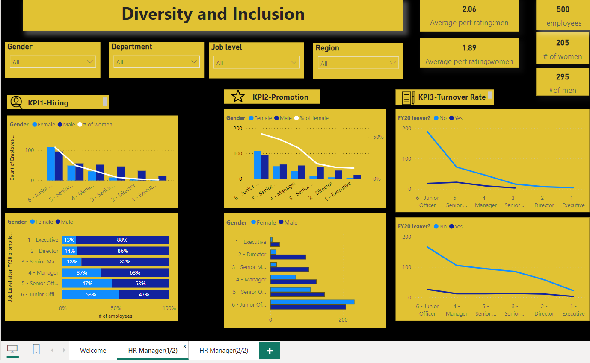

# HR Diversity and Inclusion at work place (Power BI Project)

    
Diversity and inclusion in the workplace is essential for fostering a positive and inclusive organizational culture where all employees feel valued, respected, and empowered to 
contribute their unique perspectives and talents. HR is responsible for attracting and recruiting diverse talent to the organization and should ensure that job postings reach a diverse audience, implement inclusive recruitment practices to mitigate biases, and promote diversity in candidate selection and hiring decisions.

## Introduction
---

This is a Power BI project for the Hiring Manager at Pharma Group AG company.This project is to analyze and derive insights for the HR  to make data driven decisions by providing well designed Power BI dashboard visualising the necessary KPIs and metrics.The Pharma Group AG company wants to get insights on how they hire for different positions based on gender .They also want to understand the root cause for the slow progress in achieving gender balance at Executive level.

**_Disclaimer_**  :  _The Pharma Group AG dataset was provided by PwC company during the job simulation program that l participated in._

## Problem statement
---

1. Is there a balance  on how the HR is hiring?
2. Identify the  KPIs in hiring,promotion,perfomance and turnover?

## Skills/concepts demonstrated
---

The following Power BI features were incorporated:
-	quick measures,
-	data transformation,
-	filters,
-	slicers,
-	gauge,line charts,bar charts and cards.

## Visualization
---

The report comprises of 3 pages
1.	welcome
2.	HR Manager(1/2)
3.	HR Manager(2/2)

You can interact with the **Report** [here](https://app.fabric.microsoft.com/groups/me/reports/1c407b11-1985-438c-94f5-2bd7a47f92ff/ReportSection85a22721b69153174f6b?experience=power-bi)

## Analysis:
---

   

This is the welcome page introducing the topic under analysis, that is diversity and inclusion by HR Managers when hiring.

The HR Manager hired 500 employees and of which 295 are men ,which is more compared to women.Already we are seeing some sort of exclusion of the female gender? 🤔.The average perfomance of men is again higher than the female,we can't blame the HR Manager right,when male employees are outperfoming?. More females are being employed for "junior officer" job roles and the number is decreasing as we move to higher levels.After FY20 promotion 13 % are promoted to the Executive position.

The percentage of female employees being promoted from Junior officer to Executive continues to decrease and vice versa for male employees.Females are  likely to promoted to be an Executive if they are from the HR or Sales& Marketing department.In Asia Pacific region no females are being promoted for the Executive,Manager and Senior Officer roles.The higher the job level, the lower the turnover rate.

The Executive split for FY20 AND FY21 is not balanced,it is favouring more of the male employees than females.Most of the employees hired for the Executive role are male andthey are the ones being promoted too which means the HR might not be diversifying and including fairly.

## Recommendations and conclusions
 - HR should promote diversity and inclusion by implementing unbiased hiring practices, provide diversity training, and supporting employee resource groups especially the female so that their average perfomance 
   can increase and there by increasing channces of them being promoted to Executive job roles.
